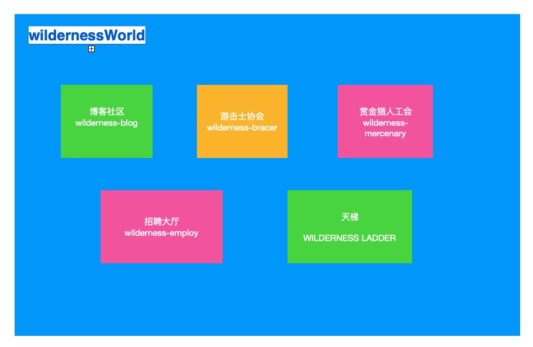
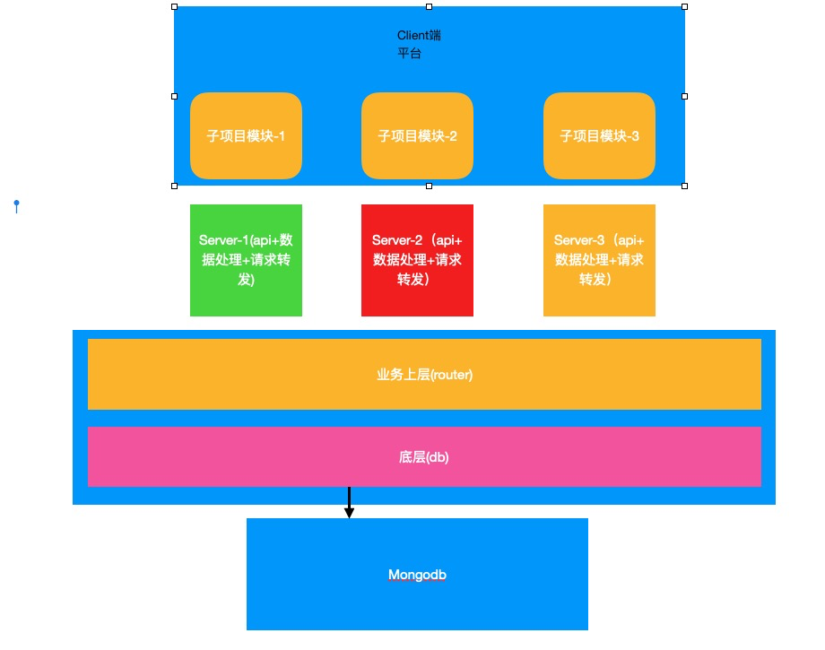

# wildernessWorld

##  wildernessWorld简介

由上图你可以直观地看到——wildernessWorld是一个开放的大型社区平台，你可以以个人的身份加入，也可以以公司为单位的团队成员身份加入，成为它的原居民。
我们考虑在社区里加入H5游戏等特性，来让wildernessWorld区别于其他社区。
它里面集成了五个模块(项目),分别是： 
### 博客社区
这是大家共享知识的地方，每个用户有独立的博客之家，并且能相互访问，好的原创博客会在社区首页、热门挂出；除此之外，还有话题社区在这里面。
### 游击士协会
这里是开源社区——大家在这个社区里扮演着游击士角色，可以相互组队去创建或者实现一些开源项目。任务大厅里会挂着奇思妙想的好点子，当然，你也可以作为一个开源项目的发起人，去召集同伴实现它。
我们衷心希望会有越来越多的人参与到中国开源建设，哪怕你是与IT无关的工作者，也可以将你的想法发出来，召集专业的ui和技术们一起实现它。
为了保证游击士协会的整体质量和信誉，我们将为此设计权限、等级、信誉等系统，期望大家会成为真正的游击士。
### 赏金猎人工会
赏金猎人工会也可以成为佣兵工会。相对于不求财的游击士协会，赏金猎人工会是外包工作者们的聚集地。
在这里，你可以在任务大厅里发布你的任务，技术们作为佣兵的角色，可以领取赏金任务——尽管我们更习惯称之为外包任务。 
我们为此设计了佣兵团的设计，希望能够提高一些开发者小队的凝聚力。
同样的，为了提高赏金猎人工会的质量，我们也将为此设计权限、等级、信誉等系统，期望大家能成为让老板们放心用、争着用的赏金猎人。

### 天梯神战之地
如果你是一个才加入社区的新手，却觉得自己足够强大(技术方面)，那么你可以通过爬天梯的方式来证明自己的实力。
我们将为不同的技术体系建立不同的天梯体系。

### 招聘大厅
我们十分欢迎以公司为单位的团队进入社区，也为他们和正在找工作的社区居民们提供了招聘大厅这样的地方。
我们甚至会帮助双方(招聘者与求职者)建立完整的预筛选、高逼格、完整的面试体系。

## 技术方案
由于每个模块都是一个独立的项目，而同时它们之间又共享很多信息。所以我们的平台要实现项目级的模块化，因此我们的项目架构初步构想为：
大中台+微服务+微前端

## 贡献榜
我们为参与到社区建设的所有贡献者们建立榜单。
我们初步构思，是想将它做成一个开源的、无收益的项目。
也做好了为此付出 服务器租用、社区活动周边 等费用。

## 参与方式 
目前你可以提issues，告诉我们你想作为什么角色参与哪个模块（包括平台和五个子项目），并留下你的联系方式(我们推荐用钉钉，次要选择才是微信)。

